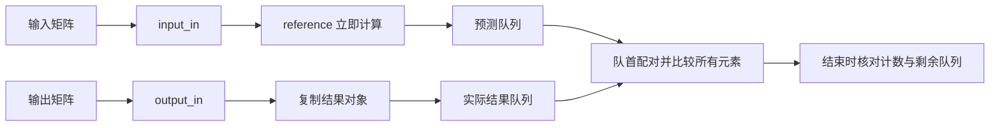

# 共用 UVM 核心：第一阶段整合

这里整理两级 testbench 将复用的矩阵数据与自动检查逻辑。当前只有组件自测，没有阵列或子系统的完整 UVM environment，也没有 DUT。源码已静态复查，**尚未通过 UVM 编译或仿真**。

## 文件与职责

| 文件 | 职责 |
| --- | --- |
| `tb/common/matrix_common_pkg.sv` | 导入 UVM，声明两种 analysis 回调并按依赖顺序包含各类 |
| `matrix_item.svh` | 参数化 A/B 输入数据；提供小数值约束及显式复制 |
| `matrix_result.svh` | 保存 `2*W` 位有符号 C 矩阵，支持独立复制 |
| `matrix_reference.svh` | 计算完整精度矩阵乘法及每个结果能否装入输出位宽的标志 |
| `matrix_prediction.svh` | 保存一份独立的预测矩阵、有效性及本地编号 |
| `matrix_scoreboard.svh` | 接收输入和输出，两队列按顺序配对，比较并检查结束状态 |
| `tb/tests/matrix_core_test.svh` | 五个组件自测；使用独立的已知结果，不实例化 DUT |
| `tb/top/matrix_core_tb.sv` | 调用 `run_test` 的顶层 |

共用类的 `W` 对应 `DIN_WIDTH`；`N`、`M` 为类型参数，并有正数检查。这不等于 DUT 支持所有正整数配置，也不实现运行时改变 M。

`matrix_item` 默认约束 A/B 元素在 -2 到 2 之间；`use_small_values=0` 可关闭该约束。这不能保证任意位宽和 M 下都不溢出。当前组件自测直接赋值，尚未调用随机化。

## 数据流与对象归属

输入回调立即计算并保存独立的预测对象，不保留发布者的输入句柄。输出回调复制结果后入队。因此发布者在回调返回后修改原对象，不应改变已保存的数据。

两条 analysis 通路允许输出回调先到或输入回调先到。每条通路内部仍要求按矩阵顺序发布；它不是乱序匹配器，也没有 DUT 事务 ID。预测编号仅用于本地错误定位。

数值不一致时仍比较完整矩阵，再移除这一对结果；不能用“队列清空”代替数值通过。`is_drained()` 只表示配对与计数完成，不表示没有 mismatch。

输入含 X/Z、参考计算失败或预测超出输出范围时，比较会阻断，并保留未处理队列供结束检查。当前尚未定义复位取消事务、每个事务的超时和溢出量化策略。

## 算术边界

乘积宽度为 `2*W`，累加宽度为 `2*W + ceil(log2(M))`；M=1 时无需额外位。计算前检查所有输入元素的 X/Z，乘积和输出比较都进行显式符号扩展。

参考函数分别返回“数学计算成功”和各元素的 `fits_output` 标志。一个准确的数学结果可能超出 DUT 输出宽度，此时暂不进行窄位宽比较。该行为记录规格缺口，不能替代尚未明确的饱和或截断规则。

## 五个组件自测

以下是预期行为，**不是已运行的 UVM 结果**。每项测试同时实例化 `(W,N,M)=(8,2,3)` 和 `(4,3,2)` 两组共用组件；正常情况共比较 3 份矩阵、17 个元素。

| UVM_TESTNAME | 场景 | 预期 |
| --- | --- | --- |
| `matrix_core_smoke_test` | 按输入后输出顺序发布已知矩阵 | 3 份 / 17 元素，无遗留、无报错 |
| `matrix_core_wrong_result_test` | 将一个结果 -83 改为 -82 | 1 个 mismatch，且结束阶段报告 `RESULT_CHECK_FAILED` |
| `matrix_core_missing_result_test` | 不发布第二份 2×2 结果 | 比较 2 份 / 13 元素；剩 1 份预测；报告 `MATRIX_COUNT` 与 `PENDING_RESULTS` |
| `matrix_core_output_first_test` | 输出回调先于输入回调 | 输入到齐后正常配对 |
| `matrix_core_snapshot_test` | 两参数组分别覆盖输入先到和输出先到；配对前修改已发布原对象 | 独立保存的预测和输出不受修改影响，仍比较 3 份 / 17 元素 |

参考结果来自数学计算；自测的实际结果是手工确定的常量，不调用参考函数生成。这样可以发现参考计算或配对错误，但不能作为阵列 RTL 正确性的证据。

额外输出、完全缺输入、X/Z 与溢出阻断、复位取消和随机参数等仍需要后续组件测试。两个完整环境还需协议时序、连续计算、FIFO 和时钟关系等测试。

## 构建与证据边界

- `make source-check`：检查清单、路径和 include；不检查 SystemVerilog 类型或语法。
- `make bundle`：展开正式源码的本地 include，保留外部 `uvm_macros.svh`；不把 lessons 编入正式核心。
- `make tools-test`：运行 Python 工具单测，日志解析输入是明确标注的合成文本。
- `make core`：使用已有 Questa 工具；缺工具报告 `NOT_RUN`，退出码 2。Questa 适配器尚未实机验证。
- `make local-check`：实际编译并运行 8 项普通 SV 教学基线，结果保存在 `sim/results/local-baseline/run.json` 及独立运行目录；不编译 `tb/common`。

运行脚本要求仿真正常结束、完整的 UVM 报告摘要、正确的完成标记与计数。负测还必须精确满足预期报错 ID；其他错误、缺结束检查、编译失败和超时都会失败。不能把负测的任意非零退出或任何包含 PASS 的文本当作验证通过。

本地基线包括参考模型的三个参数配置和一次未知值注入，以及输出重组的正常、错值、缺行和组合注入四种情况。它们延续此前普通 SV 的真实运行证据，不证明新整理的 UVM 源码可编译。
